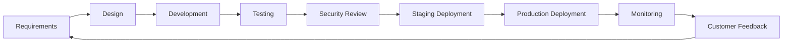
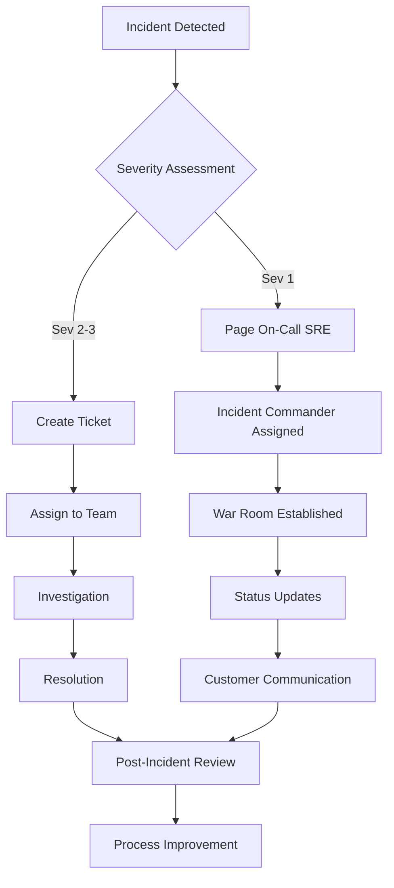
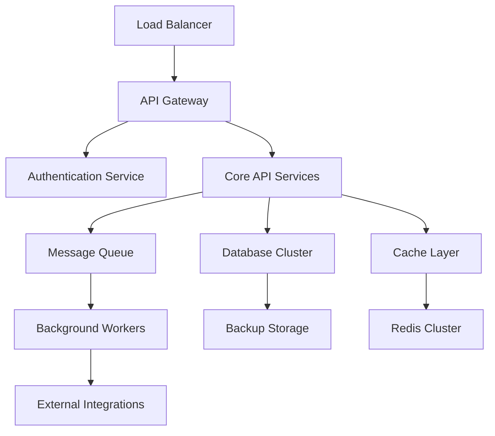

# Operating Model Overview: Affiliate Backend Platform

**Document Version**: v1.0  
**Owner**: Operations Manager  
**Last Updated**: 2025-08-05  
**Next Review**: 2026-02-05

---

## 1. Executive Summary

The Affiliate Backend Platform operates under a **DevOps-enabled, Site Reliability Engineering (SRE)** model that emphasizes automation, continuous delivery, and proactive monitoring. Our operating model ensures 99.9% availability while maintaining rapid feature delivery and cost-effective operations.

### Key Operating Principles
- **Automation First**: Minimize manual processes through Infrastructure as Code (IaC) and CI/CD pipelines
- **Shift-Left Quality**: Early testing and security integration in development lifecycle
- **Proactive Monitoring**: Prevent issues before they impact customers
- **Continuous Improvement**: Regular retrospectives and process optimization

## 2. Organizational Structure

### 2.1 Team Structure

```
                    ┌─────────────────────┐
                    │   Product Owner     │
                    │   Sarah Johnson     │
                    └──────────┬──────────┘
                               │
                    ┌─────────────────────┐
                    │  Service Manager    │
                    │    Mike Chen        │
                    └──────────┬──────────┘
                               │
        ┌──────────────────────┼──────────────────────┐
        │                      │                      │
┌───────▼────────┐    ┌────────▼────────┐    ┌───────▼────────┐
│ Development    │    │   Operations    │    │ Customer       │
│ Team           │    │   Team          │    │ Success Team   │
│                │    │                 │    │                │
│ • Tech Lead    │    │ • SRE Lead      │    │ • CS Manager   │
│ • 4 Engineers  │    │ • DevOps Eng    │    │ • 2 CS Reps    │
│ • QA Engineer  │    │ • Security Eng  │    │ • Support Eng  │
└────────────────┘    └─────────────────┘    └────────────────┘
```

### 2.2 Role Definitions

#### Product Owner (Sarah Johnson)
- **Primary Responsibilities**: Product strategy, roadmap planning, stakeholder communication
- **Key Decisions**: Feature prioritization, release planning, customer requirements
- **Escalation Authority**: Budget approval, strategic direction changes

#### Service Manager (Mike Chen)
- **Primary Responsibilities**: Service delivery, SLA management, operational excellence
- **Key Decisions**: Incident response coordination, process improvements, vendor management
- **Escalation Authority**: Service level changes, major incident response

#### Technical Lead (Alex Rodriguez)
- **Primary Responsibilities**: Technical architecture, code quality, team mentoring
- **Key Decisions**: Technology choices, design patterns, technical debt management
- **Escalation Authority**: Architecture changes, technical risk assessment

#### SRE Lead (Operations Team)
- **Primary Responsibilities**: System reliability, monitoring, capacity planning
- **Key Decisions**: Infrastructure changes, alerting rules, performance optimization
- **Escalation Authority**: Production deployments, emergency procedures

## 3. RACI Matrix

### 3.1 Service Delivery Activities

| Activity | Product Owner | Service Manager | Tech Lead | SRE Lead | Dev Team | Customer Success |
|----------|---------------|-----------------|-----------|----------|----------|------------------|
| **Feature Development** | A | I | R | C | R | I |
| **Release Planning** | R | A | C | C | C | I |
| **Incident Response** | I | A | C | R | C | R |
| **SLA Monitoring** | I | R | I | A | I | C |
| **Customer Support** | I | C | I | I | I | R/A |
| **Security Reviews** | C | A | R | R | C | I |
| **Capacity Planning** | C | A | I | R | I | I |
| **Vendor Management** | A | R | C | C | I | C |

**Legend**: R = Responsible, A = Accountable, C = Consulted, I = Informed

### 3.2 Operational Processes

| Process | Service Manager | SRE Lead | Tech Lead | Dev Team | Customer Success |
|---------|-----------------|----------|-----------|----------|------------------|
| **Change Management** | A | R | C | C | I |
| **Deployment Pipeline** | C | A | R | R | I |
| **Monitoring & Alerting** | A | R | C | I | C |
| **Backup & Recovery** | A | R | I | I | I |
| **Performance Tuning** | C | A | R | C | I |
| **Documentation Updates** | A | C | R | R | C |

## 4. Process Interfaces

### 4.1 Development Lifecycle



**Key Handoffs**:
- **Requirements → Design**: Product Owner to Technical Lead
- **Development → Testing**: Development Team to QA Engineer
- **Testing → Security**: QA Engineer to Security Engineer
- **Staging → Production**: SRE Lead approval required
- **Production → Monitoring**: Automated handoff with alert configuration

### 4.2 Incident Management Process



### 4.3 Change Management Process

| Change Type | Approval Required | Lead Time | Rollback Plan |
|-------------|------------------|-----------|---------------|
| **Emergency** | Service Manager | Immediate | Automated |
| **Standard** | Tech Lead + SRE Lead | 24 hours | Tested |
| **Major** | Product Owner + Service Manager | 1 week | Full DR test |
| **Infrastructure** | SRE Lead | 48 hours | IaC rollback |

## 5. Toolchain Overview

### 5.1 Development Tools

| Category | Primary Tool | Backup/Alternative | Owner |
|----------|--------------|-------------------|-------|
| **Source Control** | GitHub Enterprise | GitLab (backup) | Tech Lead |
| **CI/CD Pipeline** | GitHub Actions | Jenkins (legacy) | SRE Lead |
| **Code Quality** | SonarQube | CodeClimate | Tech Lead |
| **Testing** | Go testing + Testify | Custom frameworks | QA Engineer |
| **Security Scanning** | Snyk | OWASP ZAP | Security Engineer |

### 5.2 Operations Tools

| Category | Primary Tool | Backup/Alternative | Owner |
|----------|--------------|-------------------|-------|
| **Infrastructure** | Terraform | Pulumi | SRE Lead |
| **Container Orchestration** | Kubernetes (GKE) | Docker Swarm | SRE Lead |
| **Monitoring** | Prometheus + Grafana | DataDog | SRE Lead |
| **Logging** | ELK Stack | Splunk | SRE Lead |
| **Alerting** | PagerDuty | OpsGenie | SRE Lead |
| **APM** | New Relic | Jaeger | SRE Lead |

### 5.3 Communication Tools

| Category | Primary Tool | Backup/Alternative | Owner |
|----------|--------------|-------------------|-------|
| **Team Chat** | Slack | Microsoft Teams | Service Manager |
| **Video Conferencing** | Zoom | Google Meet | Service Manager |
| **Documentation** | Confluence | Notion | Service Manager |
| **Project Management** | Jira | Linear | Product Owner |
| **Status Page** | StatusPage.io | Custom solution | Customer Success |

## 6. Service Integration Points

### 6.1 External Dependencies

| Service | Provider | SLA | Escalation Contact | Backup Plan |
|---------|----------|-----|-------------------|-------------|
| **Authentication** | Supabase | 99.9% | support@supabase.com | Local JWT validation |
| **Payment Processing** | Stripe | 99.95% | support@stripe.com | Manual processing |
| **Affiliate Network** | Everflow | 99.5% | support@everflow.io | Mock service mode |
| **Cloud Infrastructure** | Google Cloud | 99.95% | GCP Support | Multi-region failover |
| **CDN** | Cloudflare | 99.9% | support@cloudflare.com | Direct origin serving |

### 6.2 Internal Service Dependencies



## 7. Performance Management

### 7.1 Key Performance Indicators (KPIs)

| Category | Metric | Target | Measurement | Owner |
|----------|--------|--------|-------------|-------|
| **Availability** | System Uptime | ≥ 99.9% | Automated monitoring | SRE Lead |
| **Performance** | API Response Time | < 200ms (95th percentile) | APM tools | SRE Lead |
| **Quality** | Bug Escape Rate | < 2% | Defect tracking | Tech Lead |
| **Customer Satisfaction** | CSAT Score | ≥ 4.5/5.0 | Survey responses | Customer Success |
| **Deployment** | Deployment Frequency | Daily | CI/CD metrics | SRE Lead |
| **Recovery** | Mean Time to Recovery | < 4 hours | Incident tracking | Service Manager |

### 7.2 Capacity Management

| Resource | Current Utilization | Threshold | Scaling Trigger | Owner |
|----------|-------------------|-----------|-----------------|-------|
| **CPU** | 45% average | 70% | Auto-scale pods | SRE Lead |
| **Memory** | 60% average | 80% | Auto-scale pods | SRE Lead |
| **Database** | 40% connections | 70% | Add read replicas | SRE Lead |
| **Storage** | 30% used | 70% | Expand volumes | SRE Lead |
| **Network** | 20% bandwidth | 60% | Scale load balancers | SRE Lead |

## 8. Financial Management

### 8.1 Cost Structure

| Category | Monthly Cost | Percentage | Optimization Owner |
|----------|--------------|------------|-------------------|
| **Cloud Infrastructure** | $15,000 | 45% | SRE Lead |
| **Third-Party Services** | $8,000 | 24% | Service Manager |
| **Personnel** | $7,000 | 21% | Product Owner |
| **Tools & Licenses** | $2,500 | 7% | Service Manager |
| **Support & Training** | $1,000 | 3% | Service Manager |

### 8.2 Cost Optimization Initiatives

1. **Reserved Instance Planning**: 20% cost reduction through 1-year commitments
2. **Auto-Scaling Optimization**: Right-sizing based on usage patterns
3. **Data Lifecycle Management**: Automated archiving of old data
4. **Tool Consolidation**: Reducing overlapping tool subscriptions

## 9. Risk Management

### 9.1 Operational Risks

| Risk | Probability | Impact | Mitigation Strategy | Owner |
|------|-------------|--------|-------------------|-------|
| **Key Personnel Departure** | Medium | High | Cross-training, documentation | Service Manager |
| **Third-Party Service Outage** | Medium | Medium | Backup providers, graceful degradation | SRE Lead |
| **Security Breach** | Low | High | Security audits, monitoring, training | Security Engineer |
| **Data Loss** | Low | High | Automated backups, DR testing | SRE Lead |
| **Capacity Overload** | Medium | Medium | Auto-scaling, capacity planning | SRE Lead |

### 9.2 Business Continuity

- **Disaster Recovery**: RTO 4 hours, RPO 1 hour
- **Business Continuity Plan**: Documented procedures for all critical scenarios
- **Regular DR Drills**: Quarterly testing of recovery procedures
- **Communication Plan**: Stakeholder notification procedures

## 10. Continuous Improvement

### 10.1 Review Cycles

| Review Type | Frequency | Participants | Outcomes |
|-------------|-----------|--------------|----------|
| **Daily Standup** | Daily | Development Team | Task coordination |
| **Weekly Operations Review** | Weekly | All teams | Operational metrics review |
| **Monthly SLA Review** | Monthly | Service Manager, SRE Lead | Performance analysis |
| **Quarterly Business Review** | Quarterly | All stakeholders | Strategic alignment |
| **Annual Operating Model Review** | Annually | All teams | Process optimization |

### 10.2 Improvement Initiatives

1. **Automation Expansion**: Reduce manual processes by 50% annually
2. **Observability Enhancement**: Improve monitoring coverage and alerting accuracy
3. **Team Development**: Skills training and certification programs
4. **Process Optimization**: Streamline workflows based on retrospective feedback

---

## Appendix A: Emergency Contacts

| Role | Primary | Secondary | Escalation |
|------|---------|-----------|------------|
| **Service Manager** | Mike Chen (+1-555-0102) | Operations Director | VP Operations |
| **SRE On-Call** | +1-555-0199 | Backup SRE | SRE Lead |
| **Security Incident** | security@company.com | CISO | CTO |
| **Executive Escalation** | CEO Assistant | CTO | Board Chair |

## Appendix B: Standard Operating Procedures

- **SOP-001**: Incident Response Procedures
- **SOP-002**: Change Management Process
- **SOP-003**: Deployment Procedures
- **SOP-004**: Backup and Recovery
- **SOP-005**: Security Incident Response
- **SOP-006**: Capacity Planning Process

---

**Document Classification**: Internal Use  
**Review Cycle**: Semi-Annual  
**Distribution**: All team members, key stakeholders  
**Version Control**: Maintained in Git repository