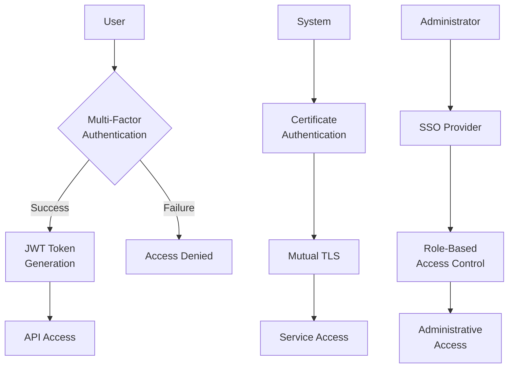
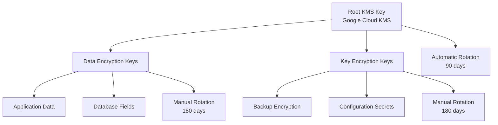
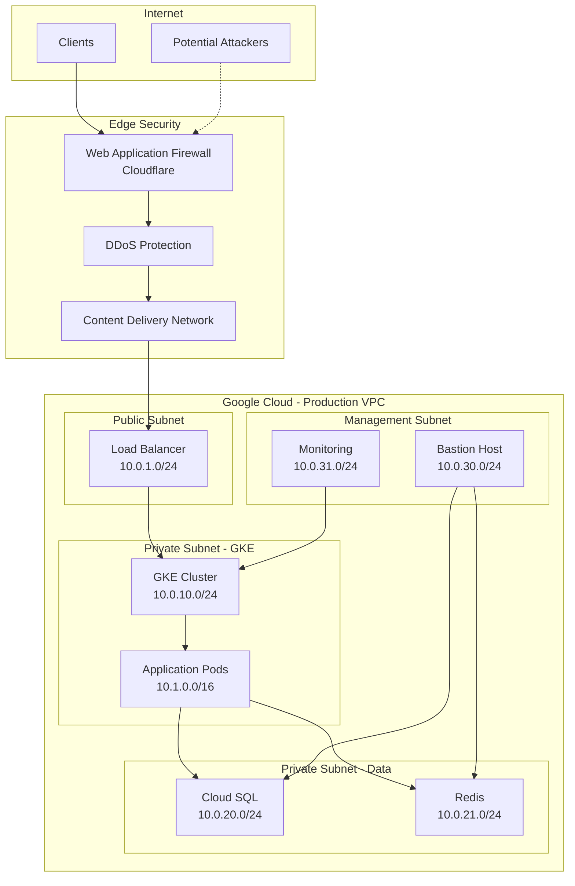
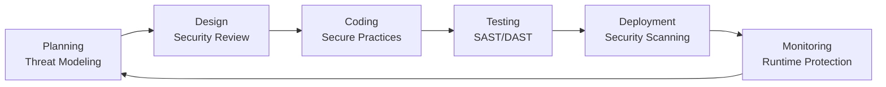
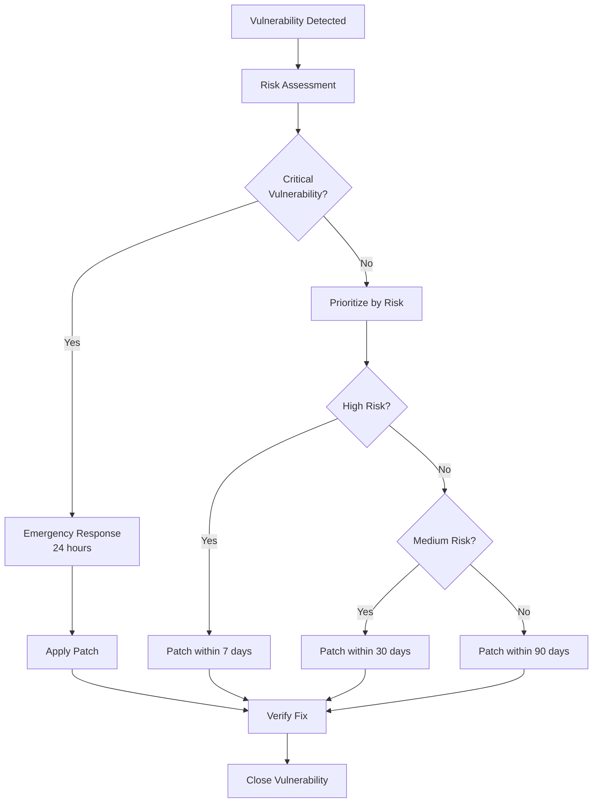
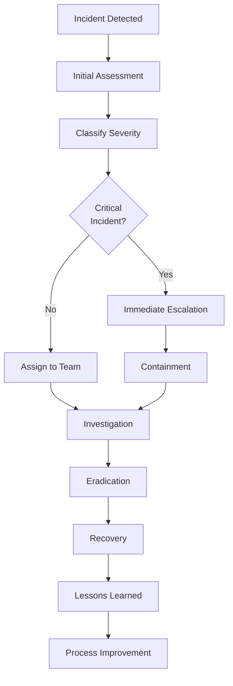

# Security & Compliance Guide: Affiliate Backend Platform

**Document Version**: v1.1  
**Owner**: Security Officer  
**Last Updated**: 2025-08-15  
**Next Review**: 2026-02-15

---

## 1. Executive Summary

The Affiliate Backend Platform implements a comprehensive security framework designed to protect customer data, ensure regulatory compliance, and maintain system integrity. This document outlines our security controls, compliance posture, and operational security procedures.

### Security Objectives
- **Confidentiality**: Protect sensitive customer and business data from unauthorized access
- **Integrity**: Ensure data accuracy and prevent unauthorized modifications
- **Availability**: Maintain system availability and resilience against attacks
- **Compliance**: Meet regulatory requirements including SOC 2, GDPR, and CCPA

### Compliance Status
- **SOC 2 Type II**: Certified (Valid until 2026-08-05)
- **GDPR**: Compliant (Last audit: 2025-06-15)
- **CCPA**: Compliant (Last audit: 2025-06-15)
- **PCI DSS**: Level 4 Merchant (Stripe handles card data)

## 2. Data Classification Framework

### 2.1 Data Classification Levels

| Classification | Definition | Examples | Handling Requirements |
|----------------|------------|----------|----------------------|
| **Public** | Information intended for public disclosure | Marketing materials, public documentation | Standard handling |
| **Internal** | Information for internal use only | Internal procedures, system architecture | Access controls required |
| **Confidential** | Sensitive business information | Customer data, financial records, API keys | Encryption required |
| **Restricted** | Highly sensitive information | Payment data, authentication secrets | Strict access controls + encryption |

### 2.2 Data Inventory

#### Customer Data (Confidential)
```yaml
Personal Identifiable Information (PII):
  - Email addresses
  - Names (first, last)
  - Phone numbers
  - IP addresses
  - User preferences

Business Data:
  - Organization details
  - Campaign information
  - Performance metrics
  - Financial transactions
  - Commission calculations

Technical Data:
  - API usage logs
  - System performance metrics
  - Error logs (sanitized)
  - Audit trails
```

#### System Data (Restricted)
```yaml
Authentication & Authorization:
  - JWT secrets
  - API keys
  - Database credentials
  - Encryption keys

Infrastructure Secrets:
  - TLS certificates
  - Service account keys
  - Third-party integration tokens
  - Backup encryption keys
```

### 2.3 Data Retention Policy

| Data Type | Retention Period | Deletion Method | Legal Hold |
|-----------|------------------|-----------------|------------|
| **Customer PII** | 7 years after account closure | Secure deletion | Yes |
| **Transaction Records** | 7 years | Secure deletion | Yes |
| **Audit Logs** | 3 years | Secure deletion | Yes |
| **System Logs** | 90 days | Automated deletion | No |
| **Backup Data** | 1 year | Encrypted deletion | Yes |
| **Development Data** | 30 days | Automated deletion | No |

## 3. Access Control Framework

### 3.1 Identity and Access Management (IAM)

#### Authentication Methods


#### Role-Based Access Control (RBAC)

| Role | Permissions | Data Access | System Access |
|------|-------------|-------------|---------------|
| **Admin** | Full system access | All data | Production systems |
| **AdvertiserManager** | Advertiser management | Organization-scoped | Staging/Production |
| **AffiliateManager** | Affiliate management | Organization-scoped | Staging/Production |
| **User** | Read-only access | Own organization only | None |
| **Support** | Customer support | Limited PII access | Read-only production |
| **Developer** | Development access | Anonymized data only | Development/Staging |
| **Auditor** | Audit access | Audit logs only | Read-only all systems |

### 3.2 Privileged Access Management

#### Administrative Access Controls
```yaml
Production Access:
  - Requires: MFA + VPN + Approved request
  - Duration: Maximum 4 hours
  - Monitoring: All actions logged and monitored
  - Approval: Service Manager + Security Officer

Database Access:
  - Method: Bastion host with session recording
  - Authentication: Certificate-based + MFA
  - Monitoring: Query logging enabled
  - Restrictions: No direct production access

Infrastructure Access:
  - Method: Google Cloud IAM with temporary tokens
  - Duration: Maximum 2 hours
  - Approval: SRE Lead + Security Officer
  - Monitoring: Cloud Audit Logs
```

### 3.3 Service Account Management

#### Service Account Inventory
| Service Account | Purpose | Permissions | Key Rotation |
|-----------------|---------|-------------|--------------|
| **gke-node-sa** | GKE node operations | Minimal GKE permissions | 90 days |
| **app-service-sa** | Application runtime | Database + external APIs | 60 days |
| **backup-sa** | Backup operations | Storage write permissions | 90 days |
| **monitoring-sa** | Metrics collection | Read-only monitoring | 90 days |
| **ci-cd-sa** | Deployment pipeline | Deployment permissions | 30 days |

## 4. Encryption Framework

### 4.1 Encryption at Rest

#### Database Encryption
```yaml
PostgreSQL Encryption:
  - Method: Google Cloud SQL encryption
  - Algorithm: AES-256
  - Key Management: Google Cloud KMS
  - Key Rotation: Automatic (90 days)

Application-Level Encryption:
  - Sensitive Fields: PII, API keys, tokens
  - Algorithm: AES-256-GCM
  - Key Management: Google Secret Manager
  - Key Rotation: Manual (180 days)

Backup Encryption:
  - Method: Client-side encryption before upload
  - Algorithm: AES-256
  - Key Storage: Google Cloud KMS
  - Verification: Integrity checks on restore
```

#### File System Encryption
```yaml
Kubernetes Persistent Volumes:
  - Method: Google Persistent Disk encryption
  - Algorithm: AES-256-XTS
  - Key Management: Google-managed keys
  - Scope: All persistent volumes

Container Images:
  - Registry: Google Container Registry
  - Encryption: At-rest encryption enabled
  - Scanning: Vulnerability scanning enabled
  - Signing: Container image signing
```

### 4.2 Encryption in Transit

#### Network Encryption
```yaml
External Communications:
  - Protocol: TLS 1.3
  - Certificates: Let's Encrypt + Google-managed
  - Cipher Suites: ECDHE-RSA-AES256-GCM-SHA384
  - HSTS: Enabled with 1-year max-age

Internal Communications:
  - Service Mesh: Istio with mutual TLS
  - Database: TLS 1.2+ required
  - Redis: TLS enabled for all connections
  - API Gateway: TLS termination at load balancer

Certificate Management:
  - Issuance: Automated via cert-manager
  - Rotation: Automatic (90 days)
  - Monitoring: Certificate expiry alerts
  - Backup: Certificates backed up to secure storage
```

### 4.3 Key Management

#### Key Hierarchy


#### Key Rotation Schedule
| Key Type | Rotation Frequency | Method | Responsible Party |
|----------|-------------------|--------|-------------------|
| **Root KMS Keys** | 90 days | Automatic | Google Cloud |
| **TLS Certificates** | 90 days | Automatic | cert-manager |
| **JWT Signing Keys** | 180 days | Manual | Security Officer |
| **Database Encryption** | 90 days | Automatic | Google Cloud SQL |
| **Application Keys** | 180 days | Manual | DevOps Engineer |
| **Service Account Keys** | 60 days | Manual | SRE Team |

## 5. Network Security

### 5.1 Network Architecture



### 5.2 Firewall Rules

#### Production Firewall Configuration
```yaml
Ingress Rules:
  - Name: allow-https
    Source: 0.0.0.0/0
    Destination: Load Balancer
    Ports: 443
    Protocol: TCP
    
  - Name: allow-health-checks
    Source: Google Health Check IPs
    Destination: GKE Nodes
    Ports: 8080
    Protocol: TCP
    
  - Name: allow-internal
    Source: 10.0.0.0/8
    Destination: All internal subnets
    Ports: All
    Protocol: TCP/UDP

Egress Rules:
  - Name: allow-external-apis
    Source: GKE Pods
    Destination: External APIs
    Ports: 443
    Protocol: TCP
    
  - Name: deny-all-default
    Source: All
    Destination: 0.0.0.0/0
    Action: DENY
    Priority: 65534
```

### 5.3 VPN and Remote Access

#### VPN Configuration
```yaml
VPN Gateway:
  - Type: Google Cloud VPN
  - Encryption: IPSec with AES-256
  - Authentication: Pre-shared keys + certificates
  - Monitoring: Connection status alerts

Remote Access:
  - Method: VPN + MFA required
  - Client: Google Cloud VPN client
  - Session Duration: Maximum 8 hours
  - Monitoring: All VPN sessions logged
```

## 6. Application Security

### 6.1 Secure Development Lifecycle (SDLC)



#### Security Gates
| Phase | Security Activity | Tools | Gate Criteria |
|-------|------------------|-------|---------------|
| **Planning** | Threat modeling | Manual review | Threats identified and mitigated |
| **Design** | Security architecture review | Manual review | Security controls documented |
| **Coding** | Static code analysis | SonarQube, Snyk | No high/critical vulnerabilities |
| **Testing** | Dynamic security testing | OWASP ZAP | No high/critical vulnerabilities |
| **Deployment** | Container scanning | Trivy, Snyk | No high/critical vulnerabilities |
| **Runtime** | Runtime protection | Falco, monitoring | Security monitoring active |

### 6.2 Input Validation and Sanitization

#### API Input Validation
```go
// Example validation middleware
func ValidateInput() gin.HandlerFunc {
    return gin.HandlerFunc(func(c *gin.Context) {
        // Validate content type
        if c.GetHeader("Content-Type") != "application/json" {
            c.JSON(400, gin.H{"error": "Invalid content type"})
            c.Abort()
            return
        }
        
        // Validate request size
        if c.Request.ContentLength > MaxRequestSize {
            c.JSON(413, gin.H{"error": "Request too large"})
            c.Abort()
            return
        }
        
        // Validate authentication
        token := c.GetHeader("Authorization")
        if !isValidJWT(token) {
            c.JSON(401, gin.H{"error": "Invalid authentication"})
            c.Abort()
            return
        }
        
        c.Next()
    })
}
```

#### Dashboard API Security Controls
```go
// Dashboard-specific security middleware
func DashboardSecurityMiddleware() gin.HandlerFunc {
    return gin.HandlerFunc(func(c *gin.Context) {
        // Rate limiting for dashboard endpoints
        if !checkRateLimit(c.ClientIP(), "dashboard", 100) {
            c.JSON(429, gin.H{"error": "Rate limit exceeded"})
            c.Abort()
            return
        }
        
        // Validate organization access
        orgID := c.GetHeader("X-Organization-ID")
        userID := c.GetString("user_id")
        if !hasOrganizationAccess(userID, orgID) {
            c.JSON(403, gin.H{"error": "Insufficient permissions"})
            c.Abort()
            return
        }
        
        // Sanitize date range parameters
        from := c.Query("from")
        to := c.Query("to")
        if !isValidDateRange(from, to) {
            c.JSON(400, gin.H{"error": "Invalid date range"})
            c.Abort()
            return
        }
        
        // Prevent data exfiltration through large date ranges
        if exceedsMaxDateRange(from, to, 365) {
            c.JSON(400, gin.H{"error": "Date range too large"})
            c.Abort()
            return
        }
        
        c.Next()
    })
}

// Everflow API key protection
func SecureEverflowClient() *EverflowClient {
    return &EverflowClient{
        APIKey:     getSecretFromVault("everflow-api-key"),
        BaseURL:    getConfigValue("everflow-base-url"),
        Timeout:    30 * time.Second,
        RetryCount: 3,
        // Implement circuit breaker for external API calls
        CircuitBreaker: NewCircuitBreaker(),
    }
}
```

#### SQL Injection Prevention
```go
// Example parameterized query
func GetUserByID(db *sql.DB, userID string) (*User, error) {
    // Use parameterized queries to prevent SQL injection
    query := `
        SELECT id, email, name, created_at 
        FROM users 
        WHERE id = $1 AND deleted_at IS NULL
    `
    
    var user User
    err := db.QueryRow(query, userID).Scan(
        &user.ID,
        &user.Email,
        &user.Name,
        &user.CreatedAt,
    )
    
    if err != nil {
        return nil, err
    }
    
    return &user, nil
}
```

### 6.3 Authentication and Session Management

#### JWT Token Security
```yaml
JWT Configuration:
  - Algorithm: RS256 (RSA with SHA-256)
  - Key Size: 2048 bits
  - Expiration: 1 hour (access tokens)
  - Refresh Token: 30 days
  - Issuer Validation: Required
  - Audience Validation: Required
  - Clock Skew: 5 minutes tolerance

Token Storage:
  - Client: Secure HTTP-only cookies
  - Server: Redis with TTL
  - Transmission: HTTPS only
  - Revocation: Blacklist support
```

#### Session Security
```yaml
Session Management:
  - Storage: Redis cluster
  - Encryption: AES-256-GCM
  - Expiration: 8 hours idle timeout
  - Regeneration: On privilege escalation
  - Invalidation: On logout/suspicious activity

Cookie Security:
  - HttpOnly: true
  - Secure: true (HTTPS only)
  - SameSite: Strict
  - Path: /
  - Domain: .affiliate-platform.com
```

## 7. Vulnerability Management

### 7.1 Vulnerability Scanning

#### Automated Scanning Schedule
| Scan Type | Frequency | Tools | Scope |
|-----------|-----------|-------|-------|
| **Container Images** | On build | Trivy, Snyk | All images |
| **Dependencies** | Daily | Snyk, GitHub Dependabot | All repositories |
| **Infrastructure** | Weekly | Google Security Scanner | GCP resources |
| **Web Application** | Weekly | OWASP ZAP | External endpoints |
| **Network** | Monthly | Nmap, Nessus | Internal networks |
| **Penetration Testing** | Quarterly | External vendor | Full system |

#### Vulnerability Response Process


### 7.2 Patch Management

#### Patching Schedule
| Component | Patch Window | Approval Required | Rollback Plan |
|-----------|--------------|------------------|---------------|
| **Critical Security** | Within 24 hours | Security Officer | Automated |
| **Operating System** | Monthly (2nd Tuesday) | SRE Lead | Snapshot rollback |
| **Application Dependencies** | Bi-weekly | Tech Lead | Git rollback |
| **Kubernetes** | Quarterly | Service Manager | Cluster rollback |
| **Database** | Quarterly | DBA + Service Manager | Point-in-time recovery |

#### Emergency Patch Process
```bash
#!/bin/bash
# Emergency patch deployment script

set -e

PATCH_ID=${1}
ENVIRONMENT=${2:-production}
APPROVAL_TICKET=${3}

echo "Deploying emergency patch: $PATCH_ID to $ENVIRONMENT"

# Verify approval
if ! verify_emergency_approval "$APPROVAL_TICKET"; then
    echo "ERROR: Emergency approval required"
    exit 1
fi

# Create backup
create_backup "$ENVIRONMENT"

# Deploy patch
deploy_patch "$PATCH_ID" "$ENVIRONMENT"

# Verify deployment
if ! verify_patch_deployment "$PATCH_ID" "$ENVIRONMENT"; then
    echo "ERROR: Patch verification failed, rolling back"
    rollback_deployment "$ENVIRONMENT"
    exit 1
fi

echo "Emergency patch deployed successfully"
send_notification "Emergency patch $PATCH_ID deployed to $ENVIRONMENT"
```

## 8. Incident Response

### 8.1 Security Incident Classification

| Severity | Definition | Examples | Response Time |
|----------|------------|----------|---------------|
| **Critical** | Active security breach | Data exfiltration, system compromise | 15 minutes |
| **High** | Potential security breach | Suspicious activity, failed attacks | 1 hour |
| **Medium** | Security policy violation | Unauthorized access attempts | 4 hours |
| **Low** | Security awareness issue | Policy violations, training needs | 24 hours |

### 8.2 Incident Response Process



### 8.3 Incident Response Team

| Role | Primary | Backup | Responsibilities |
|------|---------|--------|------------------|
| **Incident Commander** | Security Officer | CISO | Overall incident coordination |
| **Technical Lead** | SRE Lead | Senior Engineer | Technical investigation and remediation |
| **Communications** | Service Manager | Customer Success | Stakeholder communication |
| **Legal/Compliance** | Legal Counsel | Compliance Officer | Legal and regulatory requirements |
| **Forensics** | Security Engineer | External Vendor | Evidence collection and analysis |

### 8.4 Communication Plan

#### Internal Communication
```yaml
Severity 1 (Critical):
  - Immediate: Security Officer, CISO, CTO
  - Within 15 min: Incident response team
  - Within 30 min: Executive team
  - Within 1 hour: All employees

Severity 2 (High):
  - Within 1 hour: Security team, SRE team
  - Within 4 hours: Management team
  - Within 24 hours: Affected teams

External Communication:
  - Customers: Within 72 hours (if data breach)
  - Regulators: As required by law
  - Partners: As contractually required
  - Public: Only if legally required
```

## 9. Audit and Compliance

### 9.1 Audit Logging

#### Audit Log Requirements
```yaml
Authentication Events:
  - Login attempts (success/failure)
  - Password changes
  - MFA events
  - Session creation/termination
  - Privilege escalation

Data Access Events:
  - Database queries (read/write)
  - File access
  - API calls
  - Data exports
  - Configuration changes

Administrative Events:
  - User account changes
  - Permission modifications
  - System configuration changes
  - Infrastructure changes
  - Security policy updates
```

#### Log Retention and Storage
| Log Type | Retention Period | Storage Location | Access Control |
|----------|------------------|------------------|----------------|
| **Security Logs** | 7 years | Encrypted cloud storage | Security team only |
| **Audit Logs** | 3 years | Encrypted cloud storage | Auditors + Security |
| **Application Logs** | 90 days | Elasticsearch cluster | Development team |
| **System Logs** | 30 days | Local storage | Operations team |
| **Access Logs** | 1 year | Cloud logging service | Security + Operations |

### 9.2 Compliance Monitoring

#### SOC 2 Controls
```yaml
Security Controls:
  - CC6.1: Logical access controls
  - CC6.2: Authentication and authorization
  - CC6.3: System access removal
  - CC6.6: Vulnerability management
  - CC6.7: Data transmission controls
  - CC6.8: System monitoring

Availability Controls:
  - CC7.1: System monitoring
  - CC7.2: System capacity
  - CC7.3: System backup and recovery
  - CC7.4: Environmental protections

Processing Integrity Controls:
  - CC8.1: Data processing controls
  - CC8.2: System monitoring
  - CC8.3: Data validation

Confidentiality Controls:
  - CC9.1: Confidentiality controls
  - CC9.2: Data classification
```

#### GDPR Compliance
```yaml
Data Protection Principles:
  - Lawfulness, fairness, transparency
  - Purpose limitation
  - Data minimization
  - Accuracy
  - Storage limitation
  - Integrity and confidentiality
  - Accountability

Individual Rights:
  - Right to information
  - Right of access
  - Right to rectification
  - Right to erasure
  - Right to restrict processing
  - Right to data portability
  - Right to object
  - Rights related to automated decision making

Technical Measures:
  - Encryption at rest and in transit
  - Access controls and authentication
  - Data pseudonymization
  - Regular security testing
  - Incident response procedures
```

### 9.3 Compliance Reporting

#### Automated Compliance Checks
```bash
#!/bin/bash
# Compliance monitoring script

# Check encryption status
check_encryption() {
    echo "Checking encryption compliance..."
    
    # Database encryption
    if ! gcloud sql instances describe affiliate-prod-db --format="value(settings.storageAutoResize)" | grep -q "true"; then
        echo "WARNING: Database encryption not verified"
    fi
    
    # TLS configuration
    if ! curl -s -I https://api.affiliate-platform.com | grep -q "Strict-Transport-Security"; then
        echo "WARNING: HSTS header not found"
    fi
}

# Check access controls
check_access_controls() {
    echo "Checking access control compliance..."
    
    # Service account key age
    for sa in $(gcloud iam service-accounts list --format="value(email)"); do
        key_age=$(gcloud iam service-accounts keys list --iam-account="$sa" --format="value(validAfterTime)" | head -1)
        if [[ $(date -d "$key_age" +%s) -lt $(date -d "90 days ago" +%s) ]]; then
            echo "WARNING: Service account key older than 90 days: $sa"
        fi
    done
}

# Check audit logging
check_audit_logging() {
    echo "Checking audit logging compliance..."
    
    # Verify audit logs are being generated
    log_count=$(gcloud logging read "resource.type=gce_instance" --limit=1 --format="value(timestamp)" | wc -l)
    if [[ $log_count -eq 0 ]]; then
        echo "WARNING: No audit logs found"
    fi
}

# Run all checks
check_encryption
check_access_controls
check_audit_logging

echo "Compliance check completed"
```

## 10. Security Training and Awareness

### 10.1 Security Training Program

#### Training Requirements
| Role | Training Type | Frequency | Duration |
|------|---------------|-----------|----------|
| **All Employees** | Security Awareness | Annual | 2 hours |
| **Developers** | Secure Coding | Bi-annual | 4 hours |
| **Operations** | Incident Response | Quarterly | 2 hours |
| **Management** | Security Leadership | Annual | 3 hours |
| **New Hires** | Security Onboarding | Within 30 days | 3 hours |

#### Training Topics
```yaml
Security Awareness:
  - Phishing recognition
  - Password security
  - Social engineering
  - Data handling
  - Incident reporting

Secure Coding:
  - OWASP Top 10
  - Input validation
  - Authentication/authorization
  - Cryptography
  - Secure APIs

Incident Response:
  - Incident classification
  - Response procedures
  - Communication protocols
  - Evidence handling
  - Recovery processes
```

### 10.2 Security Metrics and KPIs

#### Security Performance Indicators
| Metric | Target | Measurement | Frequency |
|--------|--------|-------------|-----------|
| **Vulnerability Resolution Time** | < 7 days (high risk) | Ticket tracking | Weekly |
| **Security Training Completion** | 100% | Training system | Monthly |
| **Incident Response Time** | < 15 min (critical) | Incident logs | Monthly |
| **Failed Login Attempts** | < 1% of total | Authentication logs | Daily |
| **Patch Compliance** | > 95% | Vulnerability scanner | Weekly |
| **Security Audit Findings** | 0 high/critical | Audit reports | Quarterly |

---

## Appendix A: Security Contact Information

### Emergency Security Contacts
| Role | Primary | Phone | Email | Escalation |
|------|---------|-------|-------|------------|
| **Security Officer** | John Smith | +1-555-0201 | security@company.com | CISO |
| **Incident Commander** | Jane Doe | +1-555-0202 | incidents@company.com | CTO |
| **Legal Counsel** | Bob Johnson | +1-555-0203 | legal@company.com | General Counsel |
| **External IR Firm** | SecureResponse Inc | +1-800-SECURITY | emergency@secureresponse.com | N/A |

### Regulatory Contacts
| Authority | Contact | Phone | Email | Purpose |
|-----------|---------|-------|-------|---------|
| **Data Protection Authority** | EU DPA | +32-2-123-4567 | contact@edpb.europa.eu | GDPR compliance |
| **State Attorney General** | CA AG Office | +1-916-445-9555 | privacy@doj.ca.gov | CCPA compliance |
| **SOC 2 Auditor** | Compliance Corp | +1-555-0301 | audit@compliancecorp.com | SOC 2 audits |

## Appendix B: Security Checklists

### Security Deployment Checklist
```markdown
Pre-Deployment Security Review:
- [ ] Static code analysis completed (no high/critical issues)
- [ ] Dynamic security testing completed
- [ ] Container vulnerability scan passed
- [ ] Secrets properly managed (no hardcoded credentials)
- [ ] TLS configuration validated
- [ ] Access controls reviewed and approved
- [ ] Audit logging configured
- [ ] Monitoring and alerting configured
- [ ] Incident response procedures updated
- [ ] Security documentation updated

Post-Deployment Verification:
- [ ] Security monitoring active
- [ ] Vulnerability scanning scheduled
- [ ] Access controls functioning
- [ ] Audit logs being generated
- [ ] Security alerts configured
- [ ] Backup and recovery tested
- [ ] Incident response team notified
- [ ] Security metrics baseline established
```

### Incident Response Checklist
```markdown
Immediate Response (0-15 minutes):
- [ ] Incident detected and classified
- [ ] Incident commander notified
- [ ] Initial containment measures implemented
- [ ] Stakeholders notified per communication plan
- [ ] Evidence preservation initiated

Investigation Phase (15 minutes - 4 hours):
- [ ] Forensic analysis initiated
- [ ] Root cause analysis conducted
- [ ] Impact assessment completed
- [ ] Additional containment measures implemented
- [ ] Recovery plan developed

Recovery Phase (4+ hours):
- [ ] Systems restored from clean backups
- [ ] Security controls validated
- [ ] Monitoring enhanced
- [ ] User access reviewed
- [ ] External communications sent (if required)

Post-Incident (24-72 hours):
- [ ] Incident report completed
- [ ] Lessons learned session conducted
- [ ] Process improvements identified
- [ ] Security controls updated
- [ ] Training needs assessed
```

---

**Document Classification**: Confidential  
**Access Level**: Security Team, Management, Auditors  
**Review Cycle**: Semi-Annual  
**Related Documents**: System Architecture, Configuration Baseline, Incident Response Plan