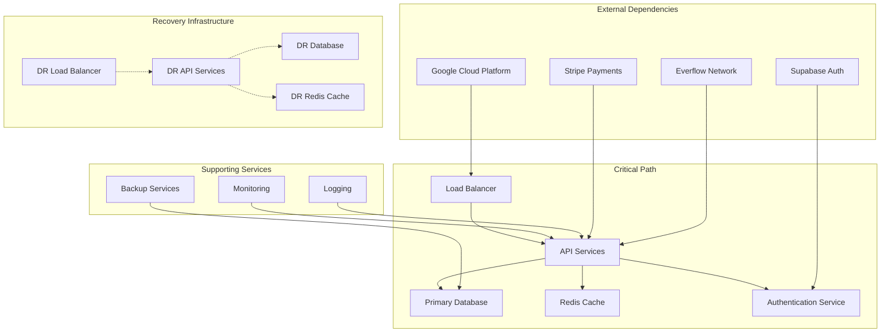
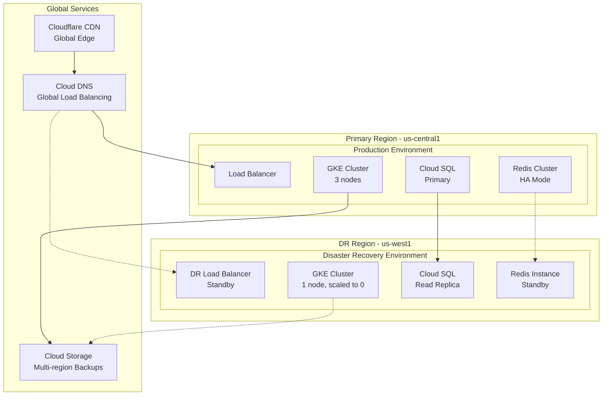
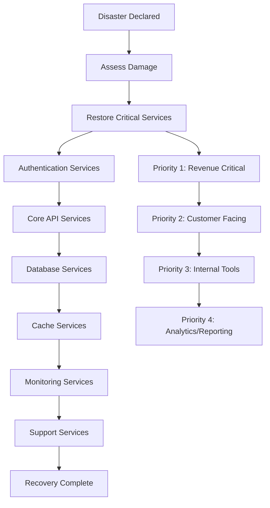
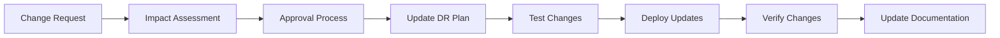

# Business Continuity Plan (BCP) / Disaster Recovery (DR) Plan

**Document Version**: v1.0  
**Owner**: SRE Lead  
**Last Updated**: 2025-08-05  
**Next Review**: 2026-02-05

---

## 1. Executive Summary

This Business Continuity Plan (BCP) and Disaster Recovery (DR) Plan ensures the Affiliate Backend Platform can continue operations during disruptions and recover quickly from disasters. The plan defines recovery objectives, procedures, and responsibilities to minimize business impact and maintain service availability.

### Key Objectives
- **Minimize Downtime**: Restore critical services within defined Recovery Time Objectives (RTO)
- **Protect Data**: Ensure data loss is limited to defined Recovery Point Objectives (RPO)
- **Maintain Communication**: Keep stakeholders informed throughout incidents
- **Ensure Compliance**: Meet regulatory and contractual obligations during disruptions

### Recovery Targets
- **RTO (Recovery Time Objective)**: 4 hours for complete service restoration
- **RPO (Recovery Point Objective)**: 1 hour maximum data loss
- **Service Availability**: 99.9% annual uptime target maintained

## 2. Risk Assessment and Business Impact Analysis

### 2.1 Threat Categories

| Threat Category | Probability | Impact | Risk Level | Mitigation Priority |
|-----------------|-------------|--------|------------|-------------------|
| **Natural Disasters** | Low | High | Medium | High |
| **Cyber Attacks** | Medium | High | High | Critical |
| **Hardware Failures** | Medium | Medium | Medium | High |
| **Software Failures** | High | Medium | Medium | High |
| **Human Error** | Medium | Medium | Medium | Medium |
| **Third-Party Outages** | Medium | Medium | Medium | Medium |
| **Network Outages** | Low | High | Medium | High |
| **Data Center Outages** | Low | High | Medium | High |

### 2.2 Business Impact Analysis

#### Critical Business Functions
```yaml
Revenue Generation:
  - Impact: $50,000/hour downtime cost
  - Dependencies: API services, database, payment processing
  - Maximum Tolerable Downtime: 4 hours
  - Recovery Priority: 1 (Highest)

Customer Support:
  - Impact: Customer satisfaction degradation
  - Dependencies: Support portal, knowledge base
  - Maximum Tolerable Downtime: 8 hours
  - Recovery Priority: 2

Analytics and Reporting:
  - Impact: Business intelligence disruption
  - Dependencies: Data warehouse, reporting services
  - Maximum Tolerable Downtime: 24 hours
  - Recovery Priority: 3

Administrative Functions:
  - Impact: Internal operations disruption
  - Dependencies: Admin interfaces, internal tools
  - Maximum Tolerable Downtime: 48 hours
  - Recovery Priority: 4
```

#### Service Dependencies


## 3. Recovery Time and Point Objectives

### 3.1 Service-Level Recovery Objectives

| Service Component | RTO | RPO | Criticality | Recovery Method |
|-------------------|-----|-----|-------------|-----------------|
| **Load Balancer** | 5 minutes | 0 | Critical | Automatic failover |
| **API Services** | 15 minutes | 0 | Critical | Container restart/failover |
| **Primary Database** | 30 minutes | 1 hour | Critical | Automated failover to standby |
| **Redis Cache** | 10 minutes | 0 | High | Cluster failover + rebuild |
| **Authentication** | 5 minutes | 0 | Critical | External service (Supabase) |
| **Monitoring** | 1 hour | 0 | Medium | Redeploy from IaC |
| **Logging** | 2 hours | 4 hours | Medium | Redeploy + restore indices |
| **Backup Services** | 4 hours | 24 hours | Low | Manual restoration |

### 3.2 Data Recovery Objectives

| Data Type | RPO | Backup Frequency | Retention | Recovery Method |
|-----------|-----|------------------|-----------|-----------------|
| **Transactional Data** | 1 hour | Continuous (WAL) | 30 days | Point-in-time recovery |
| **User Data** | 1 hour | Continuous (WAL) | 7 years | Point-in-time recovery |
| **Configuration Data** | 0 | Git commits | Indefinite | Git restore |
| **Application Logs** | 4 hours | Real-time streaming | 90 days | Log aggregation restore |
| **Monitoring Data** | 1 hour | Every 15 seconds | 1 year | Time-series DB restore |
| **Backup Metadata** | 24 hours | Daily | 1 year | Backup catalog restore |

## 4. Disaster Recovery Architecture

### 4.1 Multi-Region Failover Topology



### 4.2 Failover Scenarios

#### Scenario 1: Single Component Failure
```yaml
Trigger: Individual service component failure
Response: Automatic failover within same region
RTO: 5-15 minutes
RPO: 0-1 hour
Automation: Kubernetes self-healing, database auto-failover

Example - API Pod Failure:
  1. Kubernetes detects pod failure
  2. Automatically restarts pod on healthy node
  3. Load balancer routes traffic to healthy pods
  4. Service continues with minimal interruption
```

#### Scenario 2: Regional Outage
```yaml
Trigger: Complete primary region unavailable
Response: Manual failover to DR region
RTO: 2-4 hours
RPO: 1 hour
Automation: Semi-automated with manual approval

Failover Process:
  1. Declare regional disaster
  2. Promote DR database to primary
  3. Scale up DR GKE cluster
  4. Update DNS to point to DR region
  5. Verify service functionality
  6. Communicate to stakeholders
```

#### Scenario 3: Database Corruption
```yaml
Trigger: Database corruption or data loss
Response: Point-in-time recovery
RTO: 1-2 hours
RPO: 1 hour
Automation: Semi-automated recovery process

Recovery Process:
  1. Identify corruption extent
  2. Stop application writes
  3. Restore from point-in-time backup
  4. Validate data integrity
  5. Resume application services
  6. Verify business functions
```

## 5. Failover Procedures

### 5.1 Automated Failover Procedures

#### Database Automatic Failover
```bash
#!/bin/bash
# Automated database failover script (triggered by monitoring)

set -e

PRIMARY_INSTANCE="affiliate-prod-db"
REPLICA_INSTANCE="affiliate-prod-db-replica"
NOTIFICATION_WEBHOOK="$SLACK_WEBHOOK_URL"

echo "Starting automatic database failover..."

# Check primary database health
if ! gcloud sql instances describe "$PRIMARY_INSTANCE" --format="value(state)" | grep -q "RUNNABLE"; then
    echo "Primary database is not healthy, initiating failover"
    
    # Promote replica to primary
    gcloud sql instances promote-replica "$REPLICA_INSTANCE"
    
    # Update application configuration
    kubectl patch configmap app-config -p '{"data":{"DATABASE_HOST":"'$REPLICA_INSTANCE'"}}'
    
    # Restart application pods to pick up new config
    kubectl rollout restart deployment/affiliate-api
    
    # Send notification
    curl -X POST -H 'Content-type: application/json' \
        --data '{"text":"🚨 Database failover completed. Primary: '$REPLICA_INSTANCE'"}' \
        "$NOTIFICATION_WEBHOOK"
    
    echo "Database failover completed successfully"
else
    echo "Primary database is healthy, no failover needed"
fi
```

#### Application Auto-Recovery
```yaml
# Kubernetes deployment with auto-recovery
apiVersion: apps/v1
kind: Deployment
metadata:
  name: affiliate-api
spec:
  replicas: 3
  strategy:
    type: RollingUpdate
    rollingUpdate:
      maxUnavailable: 1
      maxSurge: 1
  template:
    spec:
      containers:
      - name: api
        image: gcr.io/affiliate-platform-prod/affiliate-api:latest
        livenessProbe:
          httpGet:
            path: /health
            port: 8080
          initialDelaySeconds: 30
          periodSeconds: 10
          failureThreshold: 3
        readinessProbe:
          httpGet:
            path: /health
            port: 8080
          initialDelaySeconds: 5
          periodSeconds: 5
          failureThreshold: 3
        resources:
          requests:
            memory: "256Mi"
            cpu: "250m"
          limits:
            memory: "512Mi"
            cpu: "500m"
```

### 5.2 Manual Failover Procedures

#### Regional Disaster Recovery Procedure
```markdown
## Regional Failover Checklist

### Phase 1: Assessment and Declaration (0-30 minutes)
- [ ] Confirm primary region is completely unavailable
- [ ] Assess scope of outage and estimated recovery time
- [ ] Declare disaster recovery activation
- [ ] Notify incident response team
- [ ] Activate war room communications

### Phase 2: DR Environment Activation (30-90 minutes)
- [ ] Scale up DR GKE cluster to production capacity
- [ ] Promote DR database replica to primary
- [ ] Update DNS records to point to DR region
- [ ] Verify DR Redis cluster is operational
- [ ] Update application configuration for DR environment

### Phase 3: Service Restoration (90-180 minutes)
- [ ] Deploy latest application version to DR environment
- [ ] Verify all critical services are operational
- [ ] Test authentication and authorization
- [ ] Validate payment processing functionality
- [ ] Confirm monitoring and alerting are active

### Phase 4: Verification and Communication (180-240 minutes)
- [ ] Perform end-to-end service testing
- [ ] Verify data integrity and consistency
- [ ] Update status page with current status
- [ ] Notify customers of service restoration
- [ ] Document lessons learned and improvements
```

#### Database Recovery Procedure
```bash
#!/bin/bash
# Manual database recovery script

set -e

BACKUP_TIMESTAMP=${1:-$(date -d "1 hour ago" +"%Y-%m-%d %H:%M:%S")}
INSTANCE_NAME="affiliate-prod-db"
RECOVERY_INSTANCE="affiliate-recovery-db"

echo "Starting database point-in-time recovery to: $BACKUP_TIMESTAMP"

# Create recovery instance
gcloud sql instances create "$RECOVERY_INSTANCE" \
    --source-instance="$INSTANCE_NAME" \
    --source-instance-region=us-central1 \
    --point-in-time="$BACKUP_TIMESTAMP"

# Wait for recovery instance to be ready
echo "Waiting for recovery instance to be ready..."
while [[ $(gcloud sql instances describe "$RECOVERY_INSTANCE" --format="value(state)") != "RUNNABLE" ]]; do
    sleep 30
    echo "Still waiting..."
done

# Validate recovered data
echo "Validating recovered data..."
RECORD_COUNT=$(gcloud sql connect "$RECOVERY_INSTANCE" --user=postgres --quiet --command="SELECT COUNT(*) FROM organizations;")
echo "Organization count in recovered database: $RECORD_COUNT"

# Promote recovery instance (manual approval required)
echo "Recovery instance ready. Manual approval required to promote to primary."
echo "Run: gcloud sql instances promote-replica $RECOVERY_INSTANCE"
```

## 6. Communication Procedures

### 6.1 Stakeholder Communication Matrix

| Stakeholder Group | Contact Method | Timing | Information Level |
|-------------------|----------------|--------|-------------------|
| **Executive Team** | Phone + Email | Immediate | High-level impact and ETA |
| **Customer Success** | Slack + Email | Within 15 min | Customer impact and messaging |
| **Development Team** | Slack | Within 15 min | Technical details and actions |
| **Operations Team** | PagerDuty + Slack | Immediate | Full technical details |
| **Customers** | Status Page + Email | Within 1 hour | Service impact and updates |
| **Partners** | Email | Within 2 hours | Integration impact |
| **Regulators** | Email | As required | Compliance implications |

### 6.2 Communication Templates

#### Internal Incident Notification
```markdown
Subject: [INCIDENT] Affiliate Platform Service Disruption - Severity 1

INCIDENT SUMMARY:
- Incident ID: INC-2025-001
- Start Time: 2025-08-05 14:30 UTC
- Severity: 1 (Critical)
- Impact: Complete service unavailability
- Affected Services: All API endpoints, customer dashboard

CURRENT STATUS:
- Primary database cluster is unresponsive
- Investigating root cause
- DR procedures being evaluated

ACTIONS TAKEN:
- Incident response team activated
- War room established (Zoom link: [URL])
- Customer notifications prepared

NEXT UPDATE: 15 minutes

Incident Commander: [Name]
Contact: [Phone] / [Email]
```

#### Customer Communication
```markdown
Subject: Service Disruption - Affiliate Platform

Dear Valued Customer,

We are currently experiencing a service disruption affecting the Affiliate Platform. Our team is actively working to resolve the issue.

IMPACT:
- API services are currently unavailable
- Dashboard access is limited
- Tracking and reporting may be delayed

ACTIONS:
- Our engineering team is investigating the root cause
- We are implementing our disaster recovery procedures
- We will provide updates every 30 minutes

ESTIMATED RESOLUTION:
We expect to restore full service within 4 hours.

For urgent support needs, please contact our emergency hotline at +1-800-AFFILIATE.

We apologize for any inconvenience and appreciate your patience.

Best regards,
Affiliate Platform Team

Status updates: https://status.affiliate-platform.com
```

### 6.3 Status Page Management

#### Automated Status Updates
```bash
#!/bin/bash
# Automated status page update script

STATUS_API_KEY="$STATUSPAGE_API_KEY"
PAGE_ID="affiliate-platform-page"
COMPONENT_ID="api-services"
STATUS=${1:-"operational"}  # operational, degraded_performance, partial_outage, major_outage

# Update component status
curl -X PATCH "https://api.statuspage.io/v1/pages/$PAGE_ID/components/$COMPONENT_ID" \
    -H "Authorization: OAuth $STATUS_API_KEY" \
    -H "Content-Type: application/json" \
    -d "{\"component\": {\"status\": \"$STATUS\"}}"

# Create incident if not operational
if [[ "$STATUS" != "operational" ]]; then
    INCIDENT_NAME="Service Disruption - $(date)"
    curl -X POST "https://api.statuspage.io/v1/pages/$PAGE_ID/incidents" \
        -H "Authorization: OAuth $STATUS_API_KEY" \
        -H "Content-Type: application/json" \
        -d "{
            \"incident\": {
                \"name\": \"$INCIDENT_NAME\",
                \"status\": \"investigating\",
                \"impact_override\": \"major\",
                \"body\": \"We are investigating reports of service disruption.\"
            }
        }"
fi

echo "Status page updated: $STATUS"
```

## 7. Testing and Validation

### 7.1 DR Testing Schedule

| Test Type | Frequency | Scope | Duration | Success Criteria |
|-----------|-----------|-------|----------|------------------|
| **Backup Verification** | Daily | Automated backup validation | 30 minutes | 100% backup success rate |
| **Component Failover** | Weekly | Individual service failover | 1 hour | RTO < 15 minutes |
| **Database Recovery** | Monthly | Point-in-time recovery test | 2 hours | RPO < 1 hour, RTO < 30 minutes |
| **Regional Failover** | Quarterly | Full DR region activation | 4 hours | Complete service restoration |
| **Full DR Exercise** | Annually | Complete disaster simulation | 8 hours | All RTO/RPO objectives met |

### 7.2 Test Procedures

#### Monthly Database Recovery Test
```bash
#!/bin/bash
# Monthly database recovery test script

set -e

TEST_DATE=$(date +"%Y-%m-%d")
TEST_INSTANCE="affiliate-test-recovery-$TEST_DATE"
SOURCE_INSTANCE="affiliate-prod-db"
TEST_TIMESTAMP=$(date -d "1 hour ago" +"%Y-%m-%d %H:%M:%S")

echo "Starting monthly database recovery test for $TEST_DATE"

# Create test recovery instance
gcloud sql instances create "$TEST_INSTANCE" \
    --source-instance="$SOURCE_INSTANCE" \
    --source-instance-region=us-central1 \
    --point-in-time="$TEST_TIMESTAMP" \
    --tier=db-custom-1-3840

# Wait for instance to be ready
echo "Waiting for test instance to be ready..."
while [[ $(gcloud sql instances describe "$TEST_INSTANCE" --format="value(state)") != "RUNNABLE" ]]; do
    sleep 30
done

# Validate data integrity
echo "Validating data integrity..."
ORG_COUNT=$(gcloud sql connect "$TEST_INSTANCE" --user=postgres --quiet --command="SELECT COUNT(*) FROM organizations;" | tail -1)
USER_COUNT=$(gcloud sql connect "$TEST_INSTANCE" --user=postgres --quiet --command="SELECT COUNT(*) FROM profiles;" | tail -1)

echo "Test Results:"
echo "- Organizations: $ORG_COUNT"
echo "- Users: $USER_COUNT"
echo "- Recovery Time: $(date)"

# Cleanup test instance
gcloud sql instances delete "$TEST_INSTANCE" --quiet

# Record test results
echo "Database recovery test completed successfully" | \
    curl -X POST -H 'Content-type: application/json' \
    --data-binary @- \
    "$SLACK_WEBHOOK_URL"

echo "Monthly database recovery test completed"
```

#### Quarterly Regional Failover Test
```markdown
## Quarterly Regional Failover Test Plan

### Pre-Test Preparation (1 week before)
- [ ] Schedule test window (low-traffic period)
- [ ] Notify all stakeholders of planned test
- [ ] Verify DR environment is ready
- [ ] Prepare test scripts and validation procedures
- [ ] Set up monitoring and logging for test

### Test Execution (4 hours)
#### Hour 1: Preparation
- [ ] Activate incident response team
- [ ] Establish communication channels
- [ ] Take baseline measurements
- [ ] Begin test documentation

#### Hour 2: Failover Execution
- [ ] Simulate primary region failure
- [ ] Execute regional failover procedures
- [ ] Monitor failover progress
- [ ] Document timing and issues

#### Hour 3: Validation
- [ ] Verify all services are operational in DR region
- [ ] Test critical business functions
- [ ] Validate data consistency
- [ ] Perform end-to-end testing

#### Hour 4: Failback
- [ ] Execute failback to primary region
- [ ] Verify primary region functionality
- [ ] Compare data consistency
- [ ] Document lessons learned

### Post-Test Activities (1 week after)
- [ ] Analyze test results against objectives
- [ ] Update procedures based on findings
- [ ] Schedule remediation for identified issues
- [ ] Report results to stakeholders
- [ ] Update DR documentation
```

### 7.3 Test Result Documentation

#### Test Report Template
```markdown
# DR Test Report - [Test Type] - [Date]

## Executive Summary
- **Test Date**: [Date]
- **Test Type**: [Component/Regional/Full DR]
- **Duration**: [Actual vs Planned]
- **Overall Result**: [Pass/Fail/Partial]
- **RTO Achievement**: [Actual vs Target]
- **RPO Achievement**: [Actual vs Target]

## Test Objectives
- [ ] Objective 1: [Description] - [Pass/Fail]
- [ ] Objective 2: [Description] - [Pass/Fail]
- [ ] Objective 3: [Description] - [Pass/Fail]

## Test Results
### Timeline
| Time | Activity | Status | Notes |
|------|----------|--------|-------|
| 09:00 | Test initiation | Complete | |
| 09:15 | Failover triggered | Complete | |
| 09:30 | Service restoration | Complete | |

### Performance Metrics
- **Recovery Time Objective**: Target 4 hours, Actual [X] hours
- **Recovery Point Objective**: Target 1 hour, Actual [X] minutes
- **Data Loss**: [None/Minimal/Significant]
- **Service Availability**: [Percentage during test]

## Issues Identified
1. **Issue 1**: [Description]
   - Impact: [High/Medium/Low]
   - Root Cause: [Analysis]
   - Remediation: [Action plan]

## Recommendations
1. [Recommendation 1]
2. [Recommendation 2]
3. [Recommendation 3]

## Next Steps
- [ ] Update DR procedures
- [ ] Schedule remediation activities
- [ ] Plan next test cycle
- [ ] Communicate results to stakeholders
```

## 8. Recovery Procedures

### 8.1 Service Recovery Priorities



### 8.2 Step-by-Step Recovery Procedures

#### Critical Service Recovery (Priority 1)
```bash
#!/bin/bash
# Critical service recovery script

set -e

ENVIRONMENT=${1:-production}
RECOVERY_MODE=${2:-full}  # full, partial, minimal

echo "Starting critical service recovery for $ENVIRONMENT environment"

# Step 1: Verify infrastructure
echo "Step 1: Verifying infrastructure..."
if ! kubectl cluster-info > /dev/null 2>&1; then
    echo "ERROR: Kubernetes cluster not accessible"
    exit 1
fi

# Step 2: Restore database connectivity
echo "Step 2: Restoring database connectivity..."
DB_STATUS=$(gcloud sql instances describe affiliate-$ENVIRONMENT-db --format="value(state)")
if [[ "$DB_STATUS" != "RUNNABLE" ]]; then
    echo "Database not ready, checking replica..."
    gcloud sql instances promote-replica affiliate-$ENVIRONMENT-db-replica
fi

# Step 3: Deploy core API services
echo "Step 3: Deploying core API services..."
kubectl apply -k k8s/overlays/$ENVIRONMENT/

# Step 4: Verify service health
echo "Step 4: Verifying service health..."
kubectl wait --for=condition=ready pod -l app=affiliate-api --timeout=300s

# Step 5: Test critical endpoints
echo "Step 5: Testing critical endpoints..."
API_URL="https://api.affiliate-platform.com"
if curl -f "$API_URL/health" > /dev/null 2>&1; then
    echo "API health check passed"
else
    echo "ERROR: API health check failed"
    exit 1
fi

# Step 6: Restore monitoring
echo "Step 6: Restoring monitoring..."
kubectl apply -k k8s/monitoring/

echo "Critical service recovery completed successfully"
```

#### Data Recovery Procedures
```bash
#!/bin/bash
# Data recovery procedure

set -e

RECOVERY_POINT=${1:-"1 hour ago"}
INSTANCE_NAME="affiliate-prod-db"
BACKUP_LOCATION="gs://affiliate-prod-backups"

echo "Starting data recovery to point: $RECOVERY_POINT"

# Step 1: Stop application writes
echo "Step 1: Stopping application writes..."
kubectl scale deployment affiliate-api --replicas=0

# Step 2: Create recovery instance
echo "Step 2: Creating recovery instance..."
RECOVERY_TIMESTAMP=$(date -d "$RECOVERY_POINT" +"%Y-%m-%d %H:%M:%S")
gcloud sql instances create affiliate-recovery-temp \
    --source-instance="$INSTANCE_NAME" \
    --source-instance-region=us-central1 \
    --point-in-time="$RECOVERY_TIMESTAMP"

# Step 3: Validate recovered data
echo "Step 3: Validating recovered data..."
# Add data validation queries here

# Step 4: Promote recovery instance
echo "Step 4: Promoting recovery instance..."
read -p "Validation complete. Promote recovery instance? (y/N): " confirm
if [[ $confirm == [yY] ]]; then
    gcloud sql instances delete "$INSTANCE_NAME" --quiet
    gcloud sql instances clone affiliate-recovery-temp "$INSTANCE_NAME"
    gcloud sql instances delete affiliate-recovery-temp --quiet
fi

# Step 5: Restart applications
echo "Step 5: Restarting applications..."
kubectl scale deployment affiliate-api --replicas=3

echo "Data recovery completed"
```

### 8.3 Rollback Procedures

#### Application Rollback
```bash
#!/bin/bash
# Application rollback procedure

set -e

ENVIRONMENT=${1:-production}
ROLLBACK_VERSION=${2}

if [[ -z "$ROLLBACK_VERSION" ]]; then
    echo "ERROR: Rollback version required"
    echo "Usage: $0 <environment> <version>"
    exit 1
fi

echo "Rolling back $ENVIRONMENT to version $ROLLBACK_VERSION"

# Step 1: Verify rollback version exists
if ! docker manifest inspect "gcr.io/affiliate-platform-$ENVIRONMENT/affiliate-api:$ROLLBACK_VERSION" > /dev/null 2>&1; then
    echo "ERROR: Rollback version $ROLLBACK_VERSION not found"
    exit 1
fi

# Step 2: Update deployment with rollback version
kubectl set image deployment/affiliate-api \
    api="gcr.io/affiliate-platform-$ENVIRONMENT/affiliate-api:$ROLLBACK_VERSION"

# Step 3: Wait for rollout to complete
kubectl rollout status deployment/affiliate-api --timeout=300s

# Step 4: Verify rollback success
kubectl wait --for=condition=ready pod -l app=affiliate-api --timeout=300s

# Step 5: Test service functionality
API_URL="https://api.affiliate-platform.com"
if curl -f "$API_URL/health" > /dev/null 2>&1; then
    echo "Rollback completed successfully"
else
    echo "ERROR: Rollback verification failed"
    exit 1
fi
```

## 9. Post-Disaster Recovery

### 9.1 Service Restoration Verification

#### Verification Checklist
```markdown
## Post-Recovery Verification Checklist

### Infrastructure Verification
- [ ] All Kubernetes nodes are healthy and ready
- [ ] Database cluster is operational with proper replication
- [ ] Redis cache cluster is operational
- [ ] Load balancers are distributing traffic correctly
- [ ] Network connectivity is restored
- [ ] SSL certificates are valid and not expired

### Application Verification
- [ ] All application pods are running and ready
- [ ] Health checks are passing for all services
- [ ] Authentication service is operational
- [ ] API endpoints are responding correctly
- [ ] Background job processing is working
- [ ] Scheduled tasks are running

### Data Verification
- [ ] Database integrity checks passed
- [ ] Data consistency verified across replicas
- [ ] Recent transactions are present
- [ ] No data corruption detected
- [ ] Backup processes are operational
- [ ] Audit logs are being generated

### External Integration Verification
- [ ] Supabase authentication is working
- [ ] Stripe payment processing is functional
- [ ] Everflow API integration is operational
- [ ] Email notifications are being sent
- [ ] Third-party webhooks are being received

### Monitoring and Alerting Verification
- [ ] Prometheus metrics collection is active
- [ ] Grafana dashboards are displaying data
- [ ] Alert rules are active and firing correctly
- [ ] PagerDuty integration is working
- [ ] Log aggregation is operational
- [ ] Status page is updated correctly
```

### 9.2 Performance Baseline Restoration

#### Performance Monitoring Script
```bash
#!/bin/bash
# Post-recovery performance monitoring

set -e

DURATION=${1:-300}  # Monitor for 5 minutes by default
API_URL="https://api.affiliate-platform.com"

echo "Starting post-recovery performance monitoring for $DURATION seconds"

# Initialize counters
TOTAL_REQUESTS=0
SUCCESSFUL_REQUESTS=0
FAILED_REQUESTS=0
TOTAL_RESPONSE_TIME=0

START_TIME=$(date +%s)
END_TIME=$((START_TIME + DURATION))

while [[ $(date +%s) -lt $END_TIME ]]; do
    # Test API response time
    RESPONSE_TIME=$(curl -o /dev/null -s -w "%{time_total}" "$API_URL/health")
    HTTP_CODE=$(curl -o /dev/null -s -w "%{http_code}" "$API_URL/health")
    
    TOTAL_REQUESTS=$((TOTAL_REQUESTS + 1))
    TOTAL_RESPONSE_TIME=$(echo "$TOTAL_RESPONSE_TIME + $RESPONSE_TIME" | bc)
    
    if [[ $HTTP_CODE -eq 200 ]]; then
        SUCCESSFUL_REQUESTS=$((SUCCESSFUL_REQUESTS + 1))
    else
        FAILED_REQUESTS=$((FAILED_REQUESTS + 1))
    fi
    
    sleep 1
done

# Calculate metrics
AVERAGE_RESPONSE_TIME=$(echo "scale=3; $TOTAL_RESPONSE_TIME / $TOTAL_REQUESTS" | bc)
SUCCESS_RATE=$(echo "scale=2; $SUCCESSFUL_REQUESTS * 100 / $TOTAL_REQUESTS" | bc)

echo "Performance Monitoring Results:"
echo "- Total Requests: $TOTAL_REQUESTS"
echo "- Successful Requests: $SUCCESSFUL_REQUESTS"
echo "- Failed Requests: $FAILED_REQUESTS"
echo "- Success Rate: $SUCCESS_RATE%"
echo "- Average Response Time: ${AVERAGE_RESPONSE_TIME}s"

# Check if performance meets baseline
if (( $(echo "$SUCCESS_RATE >= 99.0" | bc -l) )) && (( $(echo "$AVERAGE_RESPONSE_TIME <= 0.5" | bc -l) )); then
    echo "✅ Performance baseline met"
    exit 0
else
    echo "❌ Performance baseline not met"
    exit 1
fi
```

### 9.3 Post-Incident Review Process

#### Post-Incident Review Template
```markdown
# Post-Incident Review - [Incident ID] - [Date]

## Incident Summary
- **Incident ID**: INC-2025-001
- **Date/Time**: 2025-08-05 14:30 UTC - 2025-08-05 18:45 UTC
- **Duration**: 4 hours 15 minutes
- **Severity**: 1 (Critical)
- **Impact**: Complete service unavailability
- **Root Cause**: [Brief description]

## Timeline
| Time (UTC) | Event | Action Taken |
|------------|-------|--------------|
| 14:30 | Service alerts triggered | Incident response team activated |
| 14:45 | Root cause identified | DR procedures initiated |
| 15:30 | Failover to DR region | Service partially restored |
| 17:00 | Full service restored | Monitoring and validation |
| 18:45 | Incident closed | Post-incident review scheduled |

## What Went Well
1. Incident detection was immediate (< 1 minute)
2. Team response was quick and coordinated
3. DR procedures worked as designed
4. Customer communication was timely and clear
5. No data loss occurred

## What Could Be Improved
1. Failover took longer than expected (2.5 hours vs 2 hours target)
2. Some monitoring alerts were noisy and not actionable
3. Documentation was outdated in some areas
4. Customer notification could have been more frequent

## Root Cause Analysis
### Primary Cause
[Detailed analysis of the root cause]

### Contributing Factors
1. [Factor 1]
2. [Factor 2]
3. [Factor 3]

### Why This Happened
[5 Whys analysis or similar root cause methodology]

## Action Items
| Action | Owner | Due Date | Priority |
|--------|-------|----------|----------|
| Update DR documentation | SRE Lead | 2025-08-12 | High |
| Improve monitoring alerts | DevOps Engineer | 2025-08-19 | Medium |
| Automate failover process | Senior Engineer | 2025-09-02 | High |
| Conduct DR training | Service Manager | 2025-08-26 | Medium |

## Lessons Learned
1. [Lesson 1]
2. [Lesson 2]
3. [Lesson 3]

## Prevention Measures
1. [Preventive measure 1]
2. [Preventive measure 2]
3. [Preventive measure 3]

---
**Review Participants**: [List of attendees]
**Review Date**: [Date of review meeting]
**Next Review**: [Follow-up review date if needed]
```

## 10. Continuous Improvement

### 10.1 DR Plan Maintenance

#### Regular Review Schedule
| Activity | Frequency | Owner | Deliverable |
|----------|-----------|-------|-------------|
| **Plan Review** | Quarterly | SRE Lead | Updated procedures |
| **Contact Updates** | Monthly | Service Manager | Current contact list |
| **Technology Updates** | As needed | DevOps Engineer | Updated technical procedures |
| **Training Updates** | Bi-annually | All Teams | Training materials |
| **Vendor Reviews** | Annually | Service Manager | Vendor assessment |

#### Change Management Process


### 10.2 Training and Awareness

#### Training Program
| Role | Training Type | Frequency | Duration |
|------|---------------|-----------|----------|
| **All Staff** | DR Awareness | Annually | 1 hour |
| **Technical Teams** | DR Procedures | Quarterly | 2 hours |
| **Incident Response Team** | Hands-on Exercises | Monthly | 4 hours |
| **Management** | Business Continuity | Bi-annually | 2 hours |
| **New Hires** | DR Orientation | Within 30 days | 1 hour |

#### Training Scenarios
```yaml
Scenario 1 - Database Failure:
  - Objective: Practice database recovery procedures
  - Duration: 2 hours
  - Participants: SRE team, Database administrators
  - Success Criteria: Recovery within RTO/RPO targets

Scenario 2 - Regional Outage:
  - Objective: Practice full regional failover
  - Duration: 4 hours
  - Participants: All technical teams
  - Success Criteria: Complete service restoration

Scenario 3 - Cyber Attack:
  - Objective: Practice security incident response
  - Duration: 3 hours
  - Participants: Security team, Incident response team
  - Success Criteria: Containment and recovery

Scenario 4 - Communication Crisis:
  - Objective: Practice stakeholder communication
  - Duration: 1 hour
  - Participants: Management, Customer success
  - Success Criteria: Clear, timely communications
```

---

## Appendix A: Emergency Contact Information

### Primary Emergency Contacts
| Role | Name | Phone | Email | Backup |
|------|------|-------|-------|--------|
| **Incident Commander** | Sarah Johnson | +1-555-0101 | sarah.johnson@company.com | Mike Chen |
| **SRE Lead** | Alex Rodriguez | +1-555-0103 | alex.rodriguez@company.com | Senior SRE |
| **Database Administrator** | Database Team | +1-555-0199 | dba@company.com | External DBA |
| **Security Officer** | John Smith | +1-555-0201 | security@company.com | CISO |
| **Communications Lead** | Lisa Wang | +1-555-0104 | lisa.wang@company.com | Marketing Director |

### Vendor Emergency Contacts
| Vendor | Service | Phone | Email | Account ID |
|--------|---------|-------|-------|------------|
| **Google Cloud** | Infrastructure | +1-877-453-6021 | support@google.com | 123456789 |
| **Supabase** | Authentication | support@supabase.com | support@supabase.com | affiliate-prod |
| **Stripe** | Payments | +1-888-963-8331 | support@stripe.com | acct_1234567890 |
| **Cloudflare** | CDN/Security | +1-888-993-5273 | support@cloudflare.com | affiliate-platform |

## Appendix B: Recovery Scripts and Tools

### Quick Recovery Commands
```bash
# Database failover
gcloud sql instances promote-replica affiliate-prod-db-replica

# Scale up DR environment
kubectl scale deployment affiliate-api --replicas=3

# Update DNS for failover
gcloud dns record-sets transaction start --zone=affiliate-platform-zone
gcloud dns record-sets transaction add --zone=affiliate-platform-zone \
    --name=api.affiliate-platform.com. --type=A --ttl=300 "DR_IP_ADDRESS"
gcloud dns record-sets transaction execute --zone=affiliate-platform-zone

# Verify service health
curl -f https://api.affiliate-platform.com/health

# Update status page
curl -X PATCH "https://api.statuspage.io/v1/pages/PAGE_ID/components/COMPONENT_ID" \
    -H "Authorization: OAuth $STATUSPAGE_API_KEY" \
    -d '{"component": {"status": "operational"}}'
```

---

**Document Classification**: Business Critical  
**Access Level**: Incident Response Team, Management  
**Review Frequency**: Quarterly  
**Related Documents**: System Architecture, Security Guide, Runbook